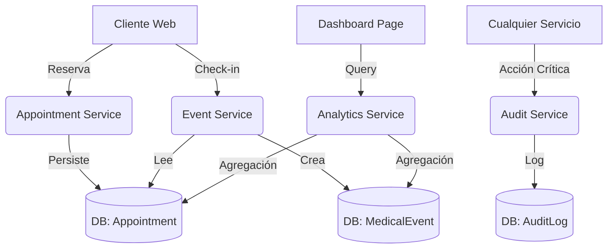

# SPEC: Implementación de Módulos Fase 2: Citas, Dashboard y Bitácora

**ID:** ARCH-20260225-06-FASE2-MODULOS  
**Autor:** INTEGRA  
**Fecha:** 2026-02-25  
**Estado:** ✅ COMPLETADO  

---

## 1. Resumen Ejecutivo
Implementación de los módulos pendientes de la Fase 2 operativa del sistema AMI: **MOD-CITAS** (Gestión de agenda), **MOD-DASHBOARD** (KPIs operativos) y **MOD-BITACORA** (Auditoría y seguridad). Estos módulos transforman el sistema de un registro clínico puro a una plataforma operativa completa.

---

## 2. Contexto y Problema
### 2.1 Situación Actual
El sistema actual ("Core") permite registrar empresas, trabajadores y capturar eventos médicos (`MedicalEvent`), pero carece de una gestión previa (agendamiento) y de visibilidad operativa (métricas). Además, no existe un registro inmutable de acciones críticas (auditoría), lo cual es riesgo para la certificación normativa.

### 2.2 Problema a Resolver
1. **Ausencia de Agenda:** No se puede planificar la capacidad de las sucursales ni gestionar recordatorios.
2. **Ciegas Operativas:** No hay forma de saber cuántas atenciones se hicieron hoy, tiempos promedio, o cuellos de botella sin consultas SQL directas.
3. **Falta de Trazabilidad:** Si un dictamen cambia de "Apto" a "No Apto", no queda registro de quién y cuándo lo hizo.

### 2.3 Usuarios Afectados
- **Recepcionistas/Coordinadores:** Para agendar y confirmar citas.
- **Administradores:** Para ver el rendimiento del negocio (Dashboard) y seguridad (Bitácora).

---

## 3. Solución Propuesta

### 3.1 Descripción General
1. **MOD-CITAS:** Nuevo modelo `Appointment` separado de `MedicalEvent` para manejar la logística previa. Al confirmar la asistencia (Check-in), la Cita se convierte/vincula a un Evento Médico.
2. **MOD-DASHBOARD:** Panel de control con widgets de métricas en tiempo real calculadas desde la BD.
3. **MOD-BITACORA:** Middleware y servicio de logging que intercepta acciones críticas (mutaciones) y las guarda en `AuditLog`.

### 3.2 Flujo de Usuario (Citas)
1. **Coordinador** selecciona Sucursal y Servicio.
2. Sistema muestra slots disponibles.
3. Se reserva el slot creando `Appointment` (Estado: `SCHEDULED`).
4. Al llegar el paciente, **Recepcionista** hace "Check-in".
5. Sistema actualiza `Appointment` a `COMPLETED` y crea `MedicalEvent` (Estado: `IN_PROGRESS`).

### 3.3 Arquitectura


---

## 4. Requisitos

### 4.1 Funcionales
**MOD-CITAS**
- [x] RF-C01: Crear, editar y cancelar citas.
- [x] RF-C02: Visualizar agenda por sucursal y día.
- [x] RF-C03: Control de estados (Programada, Cancelada, No Show, Completada).
- [x] RF-C04: Conversión de Cita a Evento Médico.

**MOD-DASHBOARD**
- [x] RF-D01: KPI Citas hoy (Total vs Atendidas).
- [x] RF-D02: KPI Estado de eventos (En proceso vs Terminados).
- [x] RF-D03: Gráfico de atenciones por empresa (Top 5).

**MOD-BITACORA**
- [x] RF-B01: Registrar login/logout.
- [x] RF-B02: Registrar cambios de estado en `MedicalEvent` y `MedicalVerdict`.
- [x] RF-B03: Vista de historial para administradores.

### 4.2 No Funcionales
- [x] RNF-01: Las consultas de Dashboard no deben tardar > 2s (usar índices).
- [x] RNF-02: `AuditLog` debe ser inmutable (append-only conceptualmente).

---

## 5. Diseño Técnico

### 5.1 Extensiones al Modelo de Datos (`schema.prisma`)

```prisma
// MOD-CITAS
model Appointment {
  id              String            @id @default(uuid())
  branchId        String
  branch          Branch            @relation(fields: [branchId], references: [id])
  workerId        String
  worker          Worker            @relation(fields: [workerId], references: [id])
  serviceProfileId String
  serviceProfile  ServiceProfile    @relation(fields: [serviceProfileId], references: [id])
  
  scheduledStart  DateTime
  scheduledEnd    DateTime
  status          AppointmentStatus @default(SCHEDULED)
  
  // Link opcional al evento médico resultante
  medicalEventId  String?           @unique
  medicalEvent    MedicalEvent?     @relation(fields: [medicalEventId], references: [id])

  createdAt       DateTime          @default(now())
  updatedAt       DateTime          @updatedAt
  
  @@index([branchId, scheduledStart])
  @@map("appointments")
}

enum AppointmentStatus {
  SCHEDULED
  CONFIRMED
  CANCELLED
  NO_SHOW
  COMPLETED // Se convirtió en MedicalEvent
}

// MOD-BITACORA
model AuditLog {
  id          String   @id @default(uuid())
  userId      String
  user        User     @relation(fields: [userId], references: [id])
  action      String   // "CREATE", "UPDATE", "DELETE", "LOGIN"
  entity      String   // "MedicalEvent", "User", etc.
  entityId    String
  details     Json?    // { changes: { status: { old: "A", new: "B" } } }
  ipAddress   String?
  userAgent   String?
  
  createdAt   DateTime @default(now())

  @@index([entityId])
  @@index([userId])
  @@map("audit_logs")
}
```

### 5.2 Server Components / Actions
- `getDailyAppointments(branchId, date)`: Server Action optimizada.
- `createAuditLog(data)`: Función utilitaria interna, invocada desde otras Actions.
- `getDashboardMetrics(tenantId)`: Aggregation query (count, groupBy).

---

## 6. Plan de Implementación

### 6.1 Tareas
| # | Tarea | Estimación | Asignado |
|---|-------|------------|----------|
| 1 | Actualizar `schema.prisma` y migración DB | 0.5h | SOFIA |
| 2 | Implementar `AppointmentService` (CRUD) | 2h | SOFIA |
| 3 | Implementar lógica "Check-in" (Cita -> Evento) | 1.5h | SOFIA |
| 4 | Implementar utility `Logger` y `AuditService` | 1h | SOFIA |
| 5 | Integrar logs en Auth y cambios de estado | 1h | SOFIA |
| 6 | Crear Server Actions para Dashboard Metrics | 2h | SOFIA |
| 7 | Crear UI Dashboard (Gráficos simples/Cards) | 3h | SOFIA |
| 8 | Crear UI Agenda (Lista/Calendario básico) | 3h | SOFIA |

### 6.2 Dependencias
- `MOD-CITAS` depende de `Branch`, `Worker` y `ServiceProfile` (ya existen).
- `MOD-DASHBOARD` depende de tener datos reales o seeders robustos.

---

## 7. Criterios de Aceptación
- [ ] Se puede agendar una cita para un trabajador existente.
- [ ] Al dar "Check-in", desaparece de "Pendientes" y aparece en "En Progreso" (Eventos).
- [ ] El Dashboard muestra números coherentes tras crear citas y eventos.
- [ ] La tabla `audit_logs` tiene registros de las operaciones realizadas.

---

## 8. Testing
- [ ] Test unitario: Crear cita superpuesta (si se valida validación).
- [ ] Test integración: Flujo Cita -> Evento verifica integridad de datos.
- [ ] Test dashboard: Verificar queries de agregación.

---
