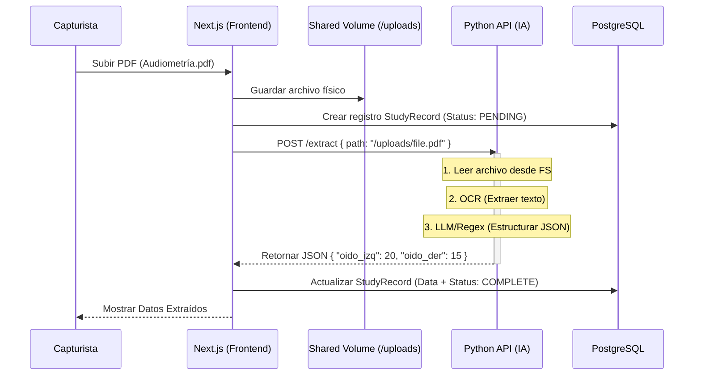

# ADR-20260203-02: Flujo de Procesamiento IA (Lector)

## Contexto
El sistema requiere extraer información automáticamente de archivos PDF/Imágenes (Estudios médicos) subidos por los capturistas.

## 🏗️ Arquitectura Propuesta (Asíncrona / Híbrida)

El flujo funciona mediante un modelo de "Volumen Compartido" para evitar mover archivos pesados por HTTP.

### Diagrama de Flujo

### 🧠 ¿Cómo funciona el "Lector"?

#### 1. Ingesta (Lo que ya hicimos)
El frontend recibe el archivo y lo deja en una carpeta que **ambos sistemas ven**.

#### 2. Extracción (Python)
Usaremos un pipeline en Python. En esta fase inicial (MVP), será un **Stub** (Simulador), pero el diseño final contempla:
*   **Librería OCR**: `PyMuPDF` o `Tesseract` para convertir la imagen/PDF a texto plano.
*   **Parser Inteligente**: 
    -   *Opción A (Reglas)*: Regex si el formato es fijo.
    -   *Opción B (LLM)*: Enviar el texto a un modelo (Gemini/OpenAI) con un prompt: "Extrae los valores de dB por frecuencia".

#### 3. Consumo (Next.js)
El frontend recibe la respuesta JSON estructurada y la guarda en la base de datos.
El médico ve los valores ya "tecleados" automáticamente, solo tiene que validar.

## Decisiones
- Se usa **Comunicación Síncrona** (HTTP POST) para el MVP para simplificar (el usuario espera unos segundos).
- En el futuro, si el proceso tarda >10s, se moverá a **Colas (Redis/Celery)**.
