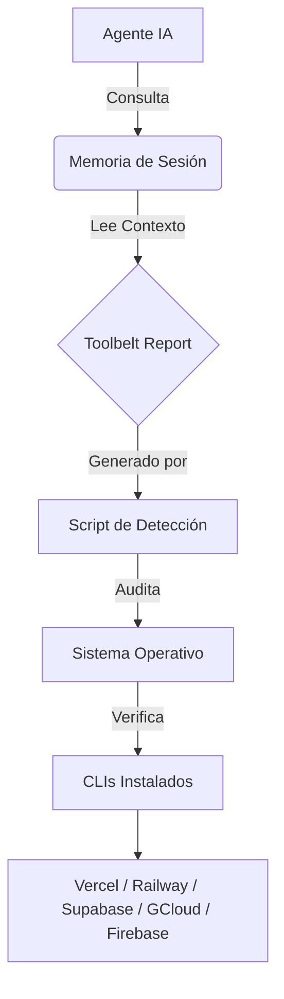

# RFC-001: INTEGRA-TOOLBELT (Resolución de Amnesia de Herramientas)

**ID:** RFC-001  
**Fecha:** 2026-03-12  
**Autor:** INTEGRA - Arquitecto (Copropiedad con Gemini 3 Pro)  
**Estado:** DRAFT  
**Scope:** INFRA (GEMINI), IMPL (SOFIA), FIX (DEBY)

---

## 1. Contexto y Problema

### El Problema de la "Amnesia de Herramientas"
Actualmente, los agentes del ecosistema INTEGRA operan como si estuvieran en un entorno aislado (sandbox), desconociendo las herramientas CLI (Command Line Interfaces) instaladas en el sistema anfitrión. Esto provoca fricción innecesaria:
1.  **Solicitudes Manuales:** El agente pide al usuario "ejecutar `vercel logs` y pegar el resultado", cuando el agente tiene permisos para ejecutarlo directamente.
2.  **Ceguera de Estado:** El agente no sabe si el deploy falló en remoto porque no consulta el estado real (ej: `railway status`), solo asume por el éxito del comando git.
3.  **Redundancia de Autenticación:** El agente asume que no está logueado y pide credenciales o tokens que ya existen en el llavero del sistema.

### Objetivo
Dotar a los agentes de "Conciencia Situacional de Herramientas" mediante **INTEGRA-TOOLBELT**, un módulo de detección y abstracción que permite a los agentes reconocer, validar y utilizar las herramientas instaladas sin intervención humana constante.

---

## 2. Solución Propuesta: INTEGRA-TOOLBELT

INTEGRA-TOOLBELT es una capa intermedia entre el Agente y el Sistema Operativo que:
1.  **Detecta** automáticamente qué CLIs están instalados.
2.  **Valida** el estado de autenticación de cada herramienta.
3.  **Expone** capacidades de alto nivel ("Ver Logs", "Reiniciar Servicio") abstrayendo el comando específico.
4.  **Persiste** el conocimiento de estas capacidades en la memoria de sesión.

### 2.1. Arquitectura de Componentes



---

## 3. Especificación Técnica

### 3.1. Fase 1: Detección (Script `audit-tools.sh`)

Se creará un script maestro en `integra-metodologia/scripts/audit-tools.sh` que se ejecutará al inicio de cada sesión o bajo demanda.

**Responsabilidades del Script:**
1.  Verificar existencia de binarios (`command -v`).
2.  Verificar autenticación (`whoami`, `auth list`, `status`).
3.  Detectar proyecto vinculado en el directorio actual (`.vercel`, `railway.toml`).
4.  Generar un reporte unificado en Markdown/JSON.

**Output Esperado (`.integra/toolbelt-report.md`):**

```markdown
# 🧰 INTEGRA TOOLBELT REPORT
*Generado: 2026-03-12 10:00:00*

## ✅ Herramientas Activas (Listas para usar)
| Herramienta | Versión | Usuario | Proyecto Vinculado |
|-------------|---------|---------|--------------------|
| **Vercel**  | 32.0.0  | frank@dev | `integra-web` (ID: prj_123) |
| **Docker**  | 24.0.0  | -       | N/A |

## ⚠️ Instaladas pero No Autenticadas
- **Railway**: CLI detectado, pero `railway whoami` falló. Ejecutar `railway login`.

## ❌ No Detectadas
- Supabase, Firebase, GCloud, AWS
```

### 3.2. Fase 2: Ingesta de Contexto (Prompts)

Los prompts de sistema de **GEMINI (INFRA)** y **SOFIA (IMPL)** se actualizarán para leer este reporte proactivamente.

**Nueva Directiva en `GLOBAL INSTRUCTIONS.instructions.md`:**
> **Protocolo TOOLBELT:** Antes de solicitar una acción manual de infraestructura o despliegue, verifica `.integra/toolbelt-report.md`. Si la herramienta necesaria (ej: Vercel, Railway) está marcada como "✅ Activa", **EJECUTA el comando CLI directamente**. No pidas permiso para leer logs, ver estados o reiniciar servicios si tienes la herramienta autenticada.

### 3.3. Fase 3: Abstracción de Comandos (Skills de Operación)

Se definirán "Skills de Operación" (`.github/skills/operate-infrastructure/SKILL.md`) que estandaricen las acciones comunes, independientemente del proveedor.

**Mapa de Abstracción (Ejemplos):**

| Intención del Usuario | Comando Abstracto | Vercel | Railway | Supabase | Docker |
|-----------------------|-------------------|--------|---------|----------|--------|
| "Ver logs error" | `op_logs --error` | `vercel logs --errors` | `railway logs` | `supabase functions logs` | `docker logs [id]` |
| "Estado del deploy" | `op_status` | `vercel inspect [url]` | `railway status` | `supabase status` | `docker ps` |
| "Reiniciar servicio" | `op_restart` | `vercel redeploy` | `railway restart` | `supabase restart` | `docker restart` |
| "Query a BD (Prod)" | `op_db_query` | N/A | `railway connect psql` | `supabase db remote commit` | `docker exec -it pg psql` |

*Nota: No es necesario crear alias de shell reales, sino "alias semánticos" que el agente entienda cómo traducir al comando real.*

---

## 4. Integración en el Flujo de Trabajo

### Escenario: Debugging de Producción con DEBY + GEMINI

1.  **Usuario:** "La app en producción está dando error 500."
2.  **DEBY (Forense):**
    *   Lee `.integra/toolbelt-report.md`.
    *   Ve que `Railway` está activo y vinculado.
    *   **Acción Autónoma:** Ejecuta `railway logs --num 50` en la terminal.
    *   Analiza los logs recuperados.
3.  **Resultado:** DEBY encuentra el error y propone el fix sin haber pedido al usuario "pégame los logs de Railway".

### Escenario: Deploy con SOFIA

1.  **SOFIA (Builder):** Termina una feature.
2.  **Check:** Verifica `toolbelt-report.md`. Ve `Vercel` activo.
3.  **Acción:** Ejecuta `vercel deploy --prebuilt` para generar una URL de preview.
4.  **Entrega:** "He desplegado la feature en [URL preview]. Por favor valida."

---

## 5. Plan de Implementación

1.  **Scripting (Día 1):**
    *   Crear `integra-metodologia/scripts/audit-tools.sh`.
    *   Implementar chequeos para: Vercel, Railway, Supabase, Firebase, GCloud, Docker, Node/Npm/Pnpm.

2.  **Integración (Día 1):**
    *   Modificar `GLOBAL INSTRUCTIONS` para incluir la directiva TOOLBELT.
    *   Asegurar que el script se corra al inicio (vía tarea de VSCode `tasks.json` o instrucción manual inicial).

3.  **Skills (Día 2):**
    *   Crear `operate-infrastructure` skill con la tabla de traducción de comandos.

4.  **Validación:**
    *   Prueba de concepto con un proyecto conectado a Vercel o Railway.

---

## 6. Seguridad y Límites

*   **Solo Lectura por Defecto:** Los agentes preferirán comandos de lectura (`logs`, `status`, `list`).
*   **Confirmación para Escritura:** Comandos destructivos o de modificación crítica (`env set`, `delete`, `rollback`) requerirán confirmación explícita del usuario ("Voy a ejecutar `railway volume delete`. ¿Confirma?").
*   **Secretos:** El reporte de Toolbelt **NUNCA** debe imprimir tokens o keys, solo el estado "Autenticado/No Autenticado" y el usuario/scope (si es público).
